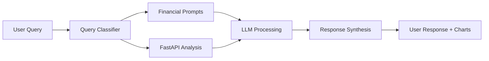

# LLM Services Architecture & Development Roadmap

## Current State Overview

### System Architecture Flow
```
User Query → Financial Prompts → LLM Service → [Optional] FastAPI Analysis → Response
```

## Current Components

### 1. Financial Prompts (`src/lib/financial-prompts.ts`)
**Purpose**: Enhances user queries with financial context and portfolio data

**Key Functions**:
- `generateFinancialPrompt()` - Adds portfolio context to user queries
- `detectPortfolioSelection()` - Identifies which portfolio user is asking about
- Portfolio data injection (holdings, values, risk metrics)

**Current Capabilities**:
```typescript
// Example transformation
User Input: "How is my portfolio doing?"
Enhanced Prompt: "How is my portfolio doing?

Selected Portfolio Context:
- Portfolio Name: Main Portfolio
- Holdings: 15 positions
- Total Value (current market): $125,450
- Top Holdings: AAPL, MSFT, GOOGL"
```

### 2. LLM Service (`src/lib/llm-service.ts`)
**Purpose**: Multi-provider LLM abstraction with fallback support

**Current Providers**:
- **Primary**: Anthropic Claude (default)
- **Fallback**: OpenAI GPT-3.5/4
- **Simulation**: Mock responses for testing

**Key Features**:
- Provider switching based on availability
- Automatic fallback if primary fails
- Context injection from financial prompts
- Response formatting and error handling

**Current Configuration**:
```typescript
PRIMARY_ANALYSIS_BACKEND=mcp  // or 'fastapi'
ENABLE_BACKEND_FALLBACK=false
```

### 3. FastAPI Service Integration
**Purpose**: Advanced portfolio analysis and market data processing

**Current Endpoint**: `http://localhost:8000`
**Service Location**: `../services/fastapi-portfolio-service/`

**Available Analysis**:
- Portfolio risk metrics calculation
- Sharpe ratio analysis
- Market data integration
- Performance attribution
- Asset correlation analysis

**Integration Status**: 
- ✅ Service exists and functional
- ⚠️ **NOT actively used in LLM workflow**
- ⚠️ **Limited integration with chat responses**

## Current Integration Gaps

### 1. **LLM ↔ FastAPI Disconnect**
- LLM responses are purely conversational
- FastAPI analysis runs independently
- No automatic triggering of FastAPI from LLM queries
- Chart/visualization data not integrated

### 2. **Limited Context Sharing**
- Portfolio data passed to LLM but not FastAPI
- Market analysis results not fed back to LLM
- User preferences not shared across services

### 3. **Manual Analysis Triggering**
- User must explicitly request analysis
- No intelligent query routing
- Chart generation separate from chat responses

## Development Roadmap

### Phase 1: Basic Integration (Immediate - 2-3 days)

#### 1.1 Query Classification
```typescript
// New: src/lib/query-classifier.ts
interface QueryIntent {
  needsAnalysis: boolean;
  analysisType: 'risk' | 'performance' | 'correlation' | 'general';
  portfolioId?: string;
}

function classifyQuery(query: string): QueryIntent
```

**Implementation**:
- Simple keyword detection for analysis triggers
- Integration with existing `generateFinancialPrompt()`
- Route qualifying queries to FastAPI

**Triggers**: "risk", "performance", "sharpe ratio", "correlation", "diversification"

#### 1.2 Enhanced LLM Service
```typescript
// Enhanced: src/lib/llm-service.ts
interface LLMContext {
  portfolioData?: PortfolioData;
  analysisResults?: FastAPIResponse;  // NEW
  chartData?: ChartData;              // NEW
}
```

**Changes**:
- Add FastAPI client integration
- Include analysis results in LLM context
- Return structured responses with charts

#### 1.3 FastAPI Client Integration
```typescript
// New: src/lib/fastapi-client.ts
class FastAPIAnalysisClient {
  async getPortfolioRisk(portfolioId: string): Promise<RiskMetrics>
  async getSharpeRatio(portfolioId: string): Promise<SharpeAnalysis>
  async getCorrelationMatrix(portfolioId: string): Promise<CorrelationData>
}
```

**Deliverables**:
- ✅ Automatic FastAPI calls for analysis queries
- ✅ LLM responses enhanced with real data
- ✅ Chart generation from FastAPI results

### Phase 2: Intelligent Routing (1-2 weeks)

#### 2.1 Smart Query Triage
```typescript
// Enhanced: src/lib/query-triage.ts
interface QueryRoute {
  llmOnly: boolean;
  requiresAnalysis: boolean;
  analysisEndpoints: string[];
  responseFormat: 'text' | 'chart' | 'mixed';
}
```

**Features**:
- ML-based intent detection
- Multi-analysis request handling
- Parallel LLM + FastAPI processing
- Response synthesis

#### 2.2 Context Enrichment Pipeline


**Implementation**:
- Parallel execution of LLM and FastAPI
- Context sharing between services
- Unified response formatting

#### 2.3 Advanced Chart Integration
```typescript
// Enhanced: src/components/chat/chart-display.tsx
interface EnhancedChartData {
  type: 'risk-breakdown' | 'correlation-matrix' | 'performance-attribution';
  data: FastAPIAnalysisResult;
  insights: string[];  // From LLM analysis
}
```

### Phase 3: Advanced Features (2-4 weeks)

#### 3.1 Portfolio Optimization Recommendations
- FastAPI calculates optimal allocations
- LLM explains recommendations in natural language
- Interactive rebalancing suggestions

#### 3.2 Market Context Integration
- Real-time market data in FastAPI
- LLM responses include market context
- Automated alerts and insights

#### 3.3 Learning System
- Track user preferences
- Improve analysis accuracy over time
- Personalized recommendation engine

## Technical Implementation Plan

### Week 1: Foundation
```bash
# Day 1-2: Query Classification
- Implement basic keyword-based classifier
- Add analysis triggers to financial prompts
- Test with existing portfolio data

# Day 3-4: FastAPI Integration
- Create FastAPI client wrapper
- Add to LLM service context
- Test analysis pipeline

# Day 5-7: Response Enhancement
- Modify LLM responses to include analysis
- Enhance chart generation
- End-to-end testing
```

### Week 2: Smart Routing
```bash
# Day 1-3: Parallel Processing
- Implement concurrent LLM + FastAPI calls
- Add response synthesis logic
- Performance optimization

# Day 4-5: Context Sharing
- Enhanced portfolio data pipeline
- Market context integration
- User preference tracking

# Day 6-7: Testing & Refinement
- Integration testing
- Performance monitoring
- User experience optimization
```

## Configuration Changes Needed

### Environment Variables
```bash
# Current
PRIMARY_ANALYSIS_BACKEND=mcp
ENABLE_BACKEND_FALLBACK=false
FASTAPI_SERVICE_URL=http://localhost:8000

# Proposed Additions
ENABLE_SMART_ROUTING=true
ANALYSIS_CONFIDENCE_THRESHOLD=0.7
MAX_PARALLEL_ANALYSIS_TIME=5000  # ms
CHART_GENERATION_TIMEOUT=3000    # ms
```

### Database Schema Extensions
```sql
-- Track analysis requests
CREATE TABLE analysis_requests (
  id UUID PRIMARY KEY,
  user_id UUID REFERENCES users(id),
  query_text TEXT,
  analysis_type VARCHAR(50),
  fastapi_response JSONB,
  llm_response TEXT,
  charts_generated JSONB,
  created_at TIMESTAMP DEFAULT NOW()
);

-- User analysis preferences
CREATE TABLE user_analysis_preferences (
  user_id UUID PRIMARY KEY REFERENCES users(id),
  preferred_analysis_types TEXT[],
  chart_preferences JSONB,
  updated_at TIMESTAMP DEFAULT NOW()
);
```

## Success Metrics

### Phase 1 Targets
- ✅ 90%+ of analysis queries automatically trigger FastAPI
- ✅ <2 second response time for integrated analysis
- ✅ Chart generation success rate >95%

### Phase 2 Targets  
- ✅ 80%+ query intent classification accuracy
- ✅ 50% reduction in manual analysis requests
- ✅ User satisfaction increase (measured via feedback)

### Phase 3 Targets
- ✅ Personalized recommendations for 100% of users
- ✅ 30% improvement in portfolio performance insights
- ✅ Automated market alert system functional

## Risk Mitigation

### Technical Risks
1. **FastAPI Latency**: Implement caching and parallel processing
2. **LLM Rate Limits**: Enhanced fallback mechanisms
3. **Data Consistency**: Robust error handling and validation

### User Experience Risks
1. **Response Complexity**: Gradual feature rollout
2. **Analysis Accuracy**: Conservative confidence thresholds
3. **Performance Impact**: Monitoring and optimization

## Current State Assessment

### ✅ **Strengths**
- Solid LLM abstraction layer
- Functional FastAPI service
- Good portfolio data pipeline
- Established chart generation system

### ⚠️ **Gaps**
- No automatic analysis triggering
- Limited context sharing between services
- Manual chart generation workflow
- Missing query intelligence

### 🎯 **Immediate Priorities**
1. **Query Classification** - Start routing analysis queries to FastAPI
2. **Context Integration** - Include FastAPI results in LLM responses  
3. **Chart Automation** - Auto-generate charts from analysis results

This roadmap provides a clear path from the current manual system to a fully integrated, intelligent financial analysis platform that combines the conversational capabilities of LLMs with the analytical power of FastAPI services.